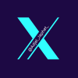
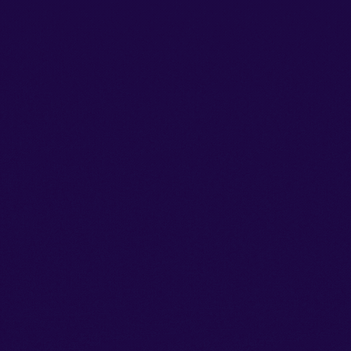

<!-- Banner -->

  

###

<h3 align="left">👩‍💻  About Me</h3>

###

  I'm continuously refining my skills, approaching every project with precision and purpose. I focus on understanding problems deeply, structuring efficient solutions, and writing clean, maintainable code. Testing and debugging are integral to my process, ensuring reliability in everything I build. With an endless passion for learning, I’m constantly exploring new technologies and best practices to improve and grow as a developer. The journey never stops—I'm always evolving. 🚀

💻 Passionate about Technology – Always eager to explore and stay updated with the latest advancements in tech. 📠Computer Science Student at KNUST – Building a strong foundation in programming, software development, and problem-solving. 🤠Open to Collaborations – Ready to contribute to innovative projects, share knowledge, and learn from others. 🚀 Tech Enthusiast – Excited about AI, software engineering, and emerging technologies that shape the future. ğŸ› ï¸ Hands-on Learner – Enjoy working on real-world projects, coding, and experimenting with new technologies. 📌 Driven & Adaptable – Always up for a challenge and committed to continuous learning and growth.

###

  

  
  
  
  

###

<h3 align="left">🛠 Language and tools</h3>

###

  
  
  
  
  
  
  
  
  
  
  
  
  
  
  
  
  

###

# 📊 GitHub Stats:

  

 

<!-- Bottom animation -->

  
  
  

